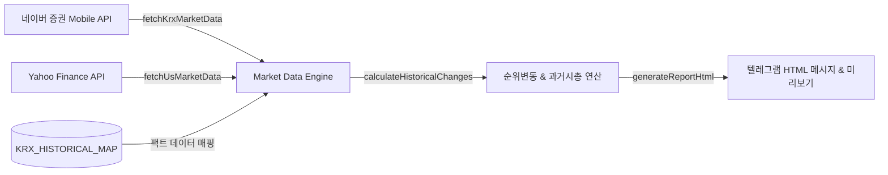

# 🛠 개발 및 배포 가이드 (DEVELOPMENT GUIDE)

본 문서는 **Google Apps Script(GAS)** 프로젝트 생성부터 텔레그램 봇 연동, Clasp CLI 자동화 배포, Market Data Engine 파이프라인 구조, 및 보안 유지보수에 대한 종합 개발 가이드입니다.

---

## 1. 📝 Google Apps Script 프로젝트 구성 및 Clasp CLI 자동화

### 1) Clasp CLI를 이용한 로컬 코드 푸시 및 배포
본 프로젝트는 Google `clasp` CLI를 통해 로컬 환경에서 온라인 GAS 프로젝트로 소스 코드를 즉시 업로드하고 버전을 관리합니다.

```bash
# 1. 의존성 및 clasp 설치 확인
npx clasp --version

# 2. 로컬 코드 온라인 GAS 프로젝트로 강제 푸시 (.claspignore 자동 적용)
npx clasp push --force

# 3. 새로운 버전 생성 및 배포 (Production Web App)
npx clasp deploy --description "v1.8 Release - Market Data Engine & Security Enhancements"

# 4. 활성화된 배포 목록 및 실행 ID 확인
npx clasp deployments

# 5. 불필요한 구버전 배포 해제 (단일 프로덕션 버전 유지)
npx clasp undeploy <DEPLOYMENT_ID>
```

### 2) `.clasp.json` 파일 구조
```json
{
  "scriptId": "15e5lRqFYzYIiO-nYcg9zLPJKGRTxSv9tSSoZ_95gLQG8K4XvEjlWF0K9",
  "rootDir": "."
}
```

---

## 2. 📊 Market Data Engine 파이프라인 및 연산 구조 (`Code.gs`)

본 시스템은 AI(LLM) 질의응답을 거치지 않으며, **100% 실시간 웹 API 파싱 및 결정론적(Deterministic) 연산 엔진**으로 동작합니다.



### 1) 실시간 데이터 파싱 (`fetchKrxMarketData`, `fetchUsMarketData`)
- **KRX (KOSPI/KOSDAK)**: 네이버 증권 모바일 API (`https://m.stock.naver.com/api/stocks/marketValue/...`) 직접 수집.
  - `closePriceRaw` (현재 종가 원화)
  - `fluctuationsRatio` (당일 등락률 %)
  - `marketValueHangeul` (한글 시가총액 조/억원)
- **US (NASDAQ/NYSE)**: Yahoo Finance Query v7 API 수집 및 Google Finance 링크 매핑.

### 2) 과거 비교 및 과거 시가총액 산출 수식 (`calculateHistoricalChanges`)
- **KRX 상위 40개 종목 팩트 DB (`KRX_HISTORICAL_MAP`)**:
  - 1일 전, 5일 전, 1개월 전, 3개월 전, 1년 전 과거 순위(`pastRank`)와 등락률(`returnRate`) 팩트 매핑.
- **순위 변동폭 산출 수식**:
  $$\text{rankShift} = \text{pastRank} - \text{currentRank}$$
  - `rankShift > 0`: 상승 (`▲X계단`), `+10` 이상은 `🚀`, `+5` 이상은 `🔥`
  - `rankShift < 0`: 하락 (`▼X계단`), `-10` 이상은 `🚨`
  - `rankShift === 0`: 유지 (`유지`)
- **과거 시가총액 역산 수식 (`config.showPastCap`)**:
  $$\text{과거 시가총액} = \frac{\text{현재 시가총액}}{1 + \left(\frac{\text{과거 대비 등락률(\%)}}{100}\right)}$$

---

## 3. 🤖 Telegram Bot 생성 및 Token / Chat ID 획득 절차

### 1단계: Telegram Bot Token 생성
1. 텔레그램 앱 실행 후 검색창에 **`@BotFather`**를 검색하여 대화를 시작합니다.
2. `/newbot` 입력 후 안내에 따라 봇 이름을 설정하고 발급된 **HTTP API Token**을 복사합니다.
   - *예시: `7123456789:AAFgH1i2j3k4L5m6N7o8P9q0R1s2T3u4V5w`*

### 2단계: Telegram Chat ID 획득
1. 텔레그램 검색창에 **`@userinfobot`**을 검색하여 자신의 개인 **Chat ID(숫자)**를 확인합니다.
2. 채널/그룹에 발송할 경우 봇을 채널의 **관리자(Admin)**로 등록 후 `"chat":{"id":-1001234567890}` 형태의 음수 Chat ID를 사용합니다.

---

## 4. ⏰ 서머타임(DST) 판별 및 스케줄링 디버깅

### 1) 미국 서머타임(DST) 판별 알고리즘 (`isUsDst`)
- 미국 동부 시간대(ET) 3월 2번째 일요일 02:00 ~ 11월 1번째 일요일 02:00 구간을 판별합니다.
  - **EDT (서머타임)**: 미국 마감 16:00 EDT = KST 다음날 **05:00** $\rightarrow$ 발송 트리거: **05:05 KST**
  - **EST (표준시)**: 미국 마감 16:00 EST = KST 다음날 **06:00** $\rightarrow$ 발송 트리거: **06:05 KST**
- 매일 새벽 01:00 KST에 `dailyTriggerCheck` 함수가 실행되어 서머타임 전환 시점 당일에 자동으로 트리거 시각을 재설정합니다.

---

## 5. 🔒 보안 및 깃허브(GitHub) 동기화 정책

1. **배포 URL 및 인증 토큰 비공개 정책**:
   - `README.md` 및 `DEVELOPMENT_GUIDE.md` 등 공개 문서에는 개인 배포 Exec URL 및 Bot Token을 직접 기재하지 않습니다.
   - 문서에 사용되는 스크린샷 에셋은 Bot Token 및 Chat ID 입력창이 빈값/플레이스홀더로 마스킹된 캡처본(`assets/dashboard_preview.png`)을 사용합니다.
2. **GitHub 저장소 푸시**:
   ```bash
   git add .
   git commit -m "v1.8 Release - Updated Market Data Engine & Documentation"
   git push origin main
   ```
