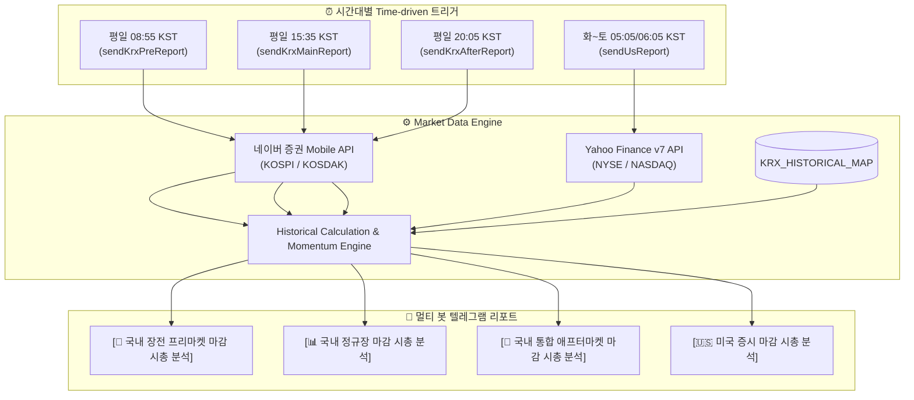

# 🛠 개발 및 배포 가이드 (DEVELOPMENT GUIDE)

본 문서는 **Google Apps Script(GAS)** 프로젝트 생성부터 텔레그램 봇 연동, Clasp CLI 자동화 배포, 2026년 9월 14일 개편된 KRX/NXT(대체거래소) 최신 운영시간 기준의 시간대별 Market Data Engine 파이프라인 구조, 및 보안 유지보수에 대한 종합 개발 가이드입니다.

---

## 1. 📝 Google Apps Script 프로젝트 구성 및 Clasp CLI 자동화

### 1) Clasp CLI를 이용한 로컬 코드 푸시 및 배포
본 프로젝트는 Google `clasp` CLI를 통해 로컬 환경에서 온라인 GAS 프로젝트로 소스 코드를 즉시 업로드하고 버전을 관리합니다.

```bash
# 1. 의존성 및 clasp 설치 확인
npx clasp --version

# 2. 로컬 코드 온라인 GAS 프로젝트로 강제 푸시 (.claspignore 자동 적용)
npx clasp push --force

# 3. 새로운 버전 생성 및 배포 (Production Web App)
npx clasp deploy --description "v2.0 Release - KRX/NXT Time-based Multi-session Engine"

# 4. 활성화된 배포 목록 및 실행 ID 확인
npx clasp deployments

# 5. 불필요한 구버전 배포 해제 (단일 프로덕션 버전 유지)
npx clasp undeploy <DEPLOYMENT_ID>
```

### 2) `.clasp.json` 파일 구조
```json
{
  "scriptId": "15e5lRqFYzYIiO-nYcg9zLPJKGRTxSv9tSSoZ_95gLQG8K4XvEjlWF0K9",
  "rootDir": "."
}
```

---

## 2. ⏰ 2026.09.14 KRX & NXT 시장 운영시간 전면 개편 명세

2026년 9월 14일부터 한국 주식시장에 대체거래소(NXT, 넥스트레이드)와의 복수 거래소 경쟁 체제가 본격 가동되며 마켓별 운영 시간 및 거래 제도가 획기적으로 개편되었습니다.

### 1) 거래소별 마켓 운영 시간 비교

| 구분 | 넥스트레이드 (NXT 대체거래소) | 한국거래소 (KRX) | 비고 및 주요 특징 |
| :--- | :--- | :--- | :--- |
| **프리마켓 (Pre-market)** | **08:00 ~ 08:50** | 미운영 (2027년 말 도입 예정) | 장 시작 전 실시간 접속매매 (출근길 거래 선점) |
| **메인마켓 (정규장)** | **09:00:30 ~ 15:20** | **09:00 ~ 15:30** | 정규 거래 세션 (KRX와 NXT 동시 운영) |
| **장후 시간외종가** | - | **15:40 ~ 16:00** | 당일 정규장 종가 고정 가격 매매 |
| **애프터마켓 (After-market)** | **15:40 ~ 20:00** | **16:00 ~ 20:00** | 기존 10분 단위 시간외단일가 폐지 $\rightarrow$ **실시간 접속매매 전면 도입** |

### 2) 2026.09.14 개편 주요 제도 변경사항
1. **체결 방식 혁신**:
   - 기존의 10분 단위 단일가 호출매매가 폐지되고, 정규장과 동일하게 호가가 일치하면 즉시 체결되는 **실시간 접속매매(Continuous Trading)** 방식으로 변경되었습니다.
2. **가격 제한폭 대폭 확대**:
   - 기존 시간외단일가(당일 종가 대비 $\pm 10\%$)에서 정규장과 동일한 **전일 종가 대비 $\pm 30\%$**로 확대되었습니다.
3. **주문 효력 및 스마트 주문(SOR)**:
   - **NXT**: 프리마켓 $\rightarrow$ 메인마켓 $\rightarrow$ 애프터마켓까지 취소 전까지 단일 세션으로 주문 효력이 유지됩니다.
   - **KRX**: 정규장 미체결 주문은 애프터마켓으로 자동 이전되지 않으므로 16:00 이후 신규 주문 제출이 필요합니다.
   - **증권사 SOR(최선집행서비스)**: 투자자가 주문 시 두 거래소(KRX, NXT)의 호가 및 체결비용을 비교하여 유리한 곳으로 자동 분기 처리됩니다.
4. **거래 대상 및 제외 종목**:
   - **KRX**: 코스피/코스닥 보통주 및 우선주 대부분 거래 가능 (약 2,500종목).
   - **NXT**: 유동성 요건을 갖춘 엄선된 600~800개 종목 거래 가능.
   - **공통 제한**: 시장 변동성 관리를 위해 **ETF(상장지수펀드) 및 ETN(상장지수증권)**은 현재 양대 거래소 모두 애프터마켓 거래 대상에서 제외됩니다.

---

## 3. 📊 시간대별 4대 Market Data Engine 파이프라인 (`Code.gs`)

본 시스템은 최신 마켓 운영 시간에 맞추어 **시간대별 4대 세션 파이프라인**을 독립적으로 구성하여 시가총액 변동과 수급을 정밀 분석합니다.



### 1) 시간대별 리포팅 세부 명세

| 발송 시각 (KST) | 핸들러 함수 | 세션 타이틀 | 핵심 분석 내용 |
| :--- | :--- | :--- | :--- |
| **평일 08:55** | `sendKrxPreReport` | `[🌅 국내 장전 프리마켓 마감 시총 분석]` | NXT 프리마켓(08:00~08:50) 체결 마감 직후 장전 수급 및 당일 개장 준비 시총/변동 분석 |
| **평일 15:35** | `sendKrxMainReport` | `[📊 국내 정규장 마감 시총 분석]` | KRX(15:30) 및 NXT(15:20) 정규 메인마켓 종가 확정 후 당일 시총 랭킹 및 순위 변동 분석 |
| **평일 20:05** | `sendKrxAfterReport` | `[🌙 국내 통합 애프터마켓 마감 시총 분석]` | 20:00 KRX & NXT 애프터마켓 완전 마감 직후 실시간 접속매매 반영 최종 시총 및 변동 분석 |
| **화~토 05:05/06:05** | `sendUsReport` | `[🇺🇸 미국 증시 마감 시총 분석]` | 미국 본장(16:00 EDT/EST) 마감 후 엔비디아/빅테크 중심 글로벌 시총 변동 분석 |

### 2) 과거 비교 및 시가총액 산출 수식 (`calculateHistoricalChanges`)
- **KRX 상위 40개 종목 팩트 DB (`KRX_HISTORICAL_MAP`)**:
  - 1일 전, 5일 전, 1개월 전, 3개월 전, 1년 전 과거 순위(`pastRank`)와 등락률(`returnRate`) 팩트 매핑.
- **순위 변동폭 산출 수식**:
  $$\text{rankShift} = \text{pastRank} - \text{currentRank}$$
  - `rankShift > 0`: 상승 (`▲X계단`), `+10` 이상은 `🚀`, `+5` 이상은 `🔥`
  - `rankShift < 0`: 하락 (`▼X계단`), `-10` 이상은 `🚨`
  - `rankShift === 0`: 유지 (`유지`)
- **과거 시가총액 역산 수식 (`config.showPastCap`)**:
  $$\text{과거 시가총액} = \frac{\text{현재 시가총액}}{1 + \left(\frac{\text{과거 대비 등락률(\%)}}{100}\right)}$$

---

## 4. 🤖 Telegram Bot 생성 및 다중 봇 등록 절차
 
### 1단계: Telegram Bot Token 생성
1. 텔레그램 앱 실행 후 검색창에 **`@BotFather`**를 검색하여 대화를 시작합니다.
2. `/newbot` 입력 후 안내에 따라 봇 이름을 설정하고 발급된 **HTTP API Token**을 복사합니다.

### 2단계: Telegram Chat ID 획득
1. 텔레그램 검색창에 **`@userinfobot`**을 검색하여 자신의 개인 **Chat ID(숫자)**를 확인합니다.
2. 채널/그룹에 발송할 경우 봇을 해당 채널의 **관리자(Admin)**로 등록 후 `"chat":{"id":-1001234567890}` 형태의 음수 Chat ID를 사용합니다.

### 3단계: 다중 봇 등록 및 동시 브리핑 (v2.1+)
1. 대시보드 상단의 **[+ 새 봇 추가]** 버튼을 클릭하여 필요한 만큼 봇 설정 카드를 추가합니다.
2. 각 봇 카드에 **별칭(예: 개인 알림, 투자 채널 등)**, **Bot Token**, **Chat ID**를 입력합니다.
3. 각 카드의 **[이 봇으로 테스트 발송]** 또는 하단의 **[활성 봇 전체 테스트 발송]**을 통해 연동을 검증합니다.
4. 특정 채널/봇의 수신을 일시 중단할 때는 **[발송 활성화]** 체크박스를 해제하면 됩니다.
5. 변경 후 하단의 **[💾 설정 저장]** 버튼을 클릭하여 보관합니다.

---

## 5. ⏰ 서머타임(DST) 판별 및 스케줄링 디버깅

### 1) 미국 서머타임(DST) 판별 알고리즘 (`isUsDst`)
- 미국 동부 시간대(ET) 3월 2번째 일요일 02:00 ~ 11월 1번째 일요일 02:00 구간을 판별합니다.
  - **EDT (서머타임)**: 미국 마감 16:00 EDT = KST 다음날 **05:00** $\rightarrow$ 발송 트리거: **05:05 KST**
  - **EST (표준시)**: 미국 마감 16:00 EST = KST 다음날 **06:00** $\rightarrow$ 발송 트리거: **06:05 KST**
- 매일 새벽 01:00 KST에 `dailyTriggerCheck` 함수가 실행되어 서머타임 전환 시점 당일에 자동으로 트리거 시각을 재설정합니다.

---

## 6. 🔒 보안 및 깃허브(GitHub) 동기화 정책

1. **배포 URL 및 인증 토큰 비공개 정책**:
   - `README.md` 및 `DEVELOPMENT_GUIDE.md` 등 공개 문서에는 개인 배포 Exec URL 및 Bot Token을 직접 기재하지 않습니다.
   - 문서에 사용되는 스크린샷 에셋은 Bot Token 및 Chat ID 입력창이 빈값/플레이스홀더로 마스킹된 캡처본(`assets/dashboard_preview.png`)을 사용합니다.
2. **GitHub 저장소 푸시**:
   ```bash
   git add .
   git commit -m "v2.0 Release - Updated KRX/NXT Market Hours & Documentation"
   git push origin main
   ```
