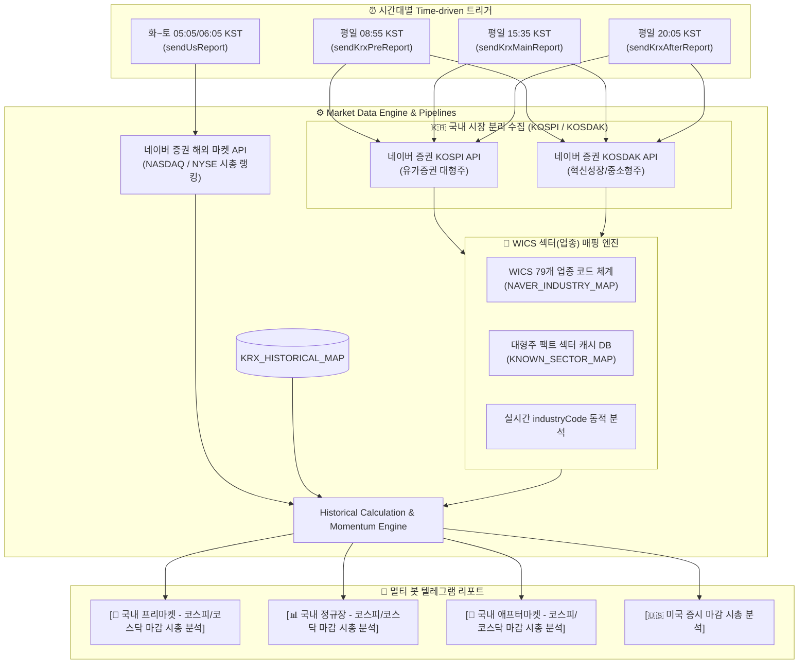

# 🛠 개발 및 배포 가이드 (DEVELOPMENT GUIDE)

본 문서는 **Google Apps Script(GAS)** 프로젝트 생성부터 텔레그램 봇 연동, Clasp CLI 자동화 배포, 2026년 9월 14일 개편된 KRX/NXT(대체거래소) 최신 운영시간 기준의 시간대별 Market Data Engine 파이프라인 구조, 및 보안 유지보수에 대한 종합 개발 가이드입니다.

---

## 1. 📝 Google Apps Script 프로젝트 구성 및 Clasp CLI 자동화

### 1) Clasp CLI를 이용한 로컬 코드 푸시 및 배포
본 프로젝트는 Google `clasp` CLI를 통해 로컬 환경에서 온라인 GAS 프로젝트로 소스 코드를 즉시 업로드하고 버전을 관리합니다.

```bash
# 1. 의존성 및 clasp 설치 확인
npx clasp --version

# 2. 로컬 코드 온라인 GAS 프로젝트로 강제 푸시 (.claspignore 자동 적용)
npx clasp push --force

# 3. 새로운 버전 생성 및 배포 (Production Web App)
npx clasp deploy --description "v2.0 Release - KRX/NXT Time-based Multi-session Engine"

# 4. 활성화된 배포 목록 및 실행 ID 확인
npx clasp deployments

# 5. 불필요한 구버전 배포 해제 (단일 프로덕션 버전 유지)
npx clasp undeploy <DEPLOYMENT_ID>
```

### 2) `.clasp.json` 파일 구조
```json
{
  "scriptId": "15e5lRqFYzYIiO-nYcg9zLPJKGRTxSv9tSSoZ_95gLQG8K4XvEjlWF0K9",
  "rootDir": "."
}
```

---

## 2. ⏰ 2026.09.14 KRX & NXT 시장 운영시간 전면 개편 명세

2026년 9월 14일부터 한국 주식시장에 대체거래소(NXT, 넥스트레이드)와의 복수 거래소 경쟁 체제가 본격 가동되며 마켓별 운영 시간 및 거래 제도가 획기적으로 개편되었습니다.

### 1) 거래소별 마켓 운영 시간 비교

| 구분 | 넥스트레이드 (NXT 대체거래소) | 한국거래소 (KRX) | 비고 및 주요 특징 |
| :--- | :--- | :--- | :--- |
| **프리마켓 (Pre-market)** | **08:00 ~ 08:50** | 미운영 (2027년 말 도입 예정) | 장 시작 전 실시간 접속매매 (출근길 거래 선점) |
| **메인마켓 (정규장)** | **09:00:30 ~ 15:20** | **09:00 ~ 15:30** | 정규 거래 세션 (KRX와 NXT 동시 운영) |
| **장후 시간외종가** | - | **15:40 ~ 16:00** | 당일 정규장 종가 고정 가격 매매 |
| **애프터마켓 (After-market)** | **15:40 ~ 20:00** | **16:00 ~ 20:00** | 기존 10분 단위 시간외단일가 폐지 $\rightarrow$ **실시간 접속매매 전면 도입** |

### 2) 2026.09.14 개편 주요 제도 변경사항
1. **체결 방식 혁신**:
   - 기존의 10분 단위 단일가 호출매매가 폐지되고, 정규장과 동일하게 호가가 일치하면 즉시 체결되는 **실시간 접속매매(Continuous Trading)** 방식으로 변경되었습니다.
2. **가격 제한폭 대폭 확대**:
   - 기존 시간외단일가(당일 종가 대비 $\pm 10\%$)에서 정규장과 동일한 **전일 종가 대비 $\pm 30\%$**로 확대되었습니다.
3. **주문 효력 및 스마트 주문(SOR)**:
   - **NXT**: 프리마켓 $\rightarrow$ 메인마켓 $\rightarrow$ 애프터마켓까지 취소 전까지 단일 세션으로 주문 효력이 유지됩니다.
   - **KRX**: 정규장 미체결 주문은 애프터마켓으로 자동 이전되지 않으므로 16:00 이후 신규 주문 제출이 필요합니다.
   - **증권사 SOR(최선집행서비스)**: 투자자가 주문 시 두 거래소(KRX, NXT)의 호가 및 체결비용을 비교하여 유리한 곳으로 자동 분기 처리됩니다.
4. **거래 대상 및 제외 종목**:
   - **KRX**: 코스피/코스닥 보통주 및 우선주 대부분 거래 가능 (약 2,500종목).
   - **NXT**: 유동성 요건을 갖춘 엄선된 600~800개 종목 거래 가능.
   - **공통 제한**: 시장 변동성 관리를 위해 **ETF(상장지수펀드) 및 ETN(상장지수증권)**은 현재 양대 거래소 모두 애프터마켓 거래 대상에서 제외됩니다.

---

## 3. 📊 시간대별 Market Data Engine 및 KOSPI / KOSDAK · 섹터 파이프라인 (`Code.gs`)

본 시스템은 최신 마켓 운영 시간에 맞추어 **시간대별 4대 세션 파이프라인**을 독립적으로 구성하며, 국내 증시 분석 시 **코스피(KOSPI)와 코스닥(KOSDAK)을 명확히 분리하여 각각 분석**하고 **종목별 표준 WICS 섹터(업종) 정보**를 결합하여 수급과 모멘텀을 정밀 분석합니다.


```mermaid
flowchart TD
    subgraph TriggerSchedule["⏰ 시간대별 Time-driven 트리거"]
        T1["평일 08:55 KST<br>(sendKrxPreReport)"]
        T2["평일 15:35 KST<br>(sendKrxMainReport)"]
        T3["평일 20:05 KST<br>(sendKrxAfterReport)"]
        T4["화~토 05:05/06:05 KST<br>(sendUsReport)"]
    end

    subgraph DataEngine["⚙️ Market Data Engine & Pipelines"]
        direction TB
        subgraph MarketSplit["🇰🇷 국내 시장 분리 수집 (KOSPI / KOSDAK)"]
            API_KOSPI["네이버 증권 KOSPI API<br>(유가증권 대형주)"]
            API_KOSDAK["네이버 증권 KOSDAK API<br>(혁신성장/중소형주)"]
        end
        subgraph SectorEngine["🏢 WICS 섹터(업종) 매핑 엔진"]
            WICS_MAP["WICS 79개 업종 코드 체계<br>(NAVER_INDUSTRY_MAP)"]
            SECTOR_CACHE["대형주 팩트 섹터 캐시 DB<br>(KNOWN_SECTOR_MAP)"]
            SECTOR_DYNAMIC["실시간 industryCode 동적 분석"]
        end
        API_US["네이버 증권 해외 마켓 API<br>(NASDAQ / NYSE 시총 랭킹)"]
        DB[(KRX_HISTORICAL_MAP)]
        Engine["Historical Calculation & Momentum Engine"]
    end

    subgraph TelegramAlerts["📱 멀티 봇 텔레그램 리포트"]
        R1["[🌅 국내 프리마켓 - 코스피/코스닥 마감 시총 분석]"]
        R2["[📊 국내 정규장 - 코스피/코스닥 마감 시총 분석]"]
        R3["[🌙 국내 애프터마켓 - 코스피/코스닥 마감 시총 분석]"]
        R4["[🇺🇸 미국 증시 마감 시총 분석]"]
    end

    T1 --> API_KOSPI & API_KOSDAK
    T2 --> API_KOSPI & API_KOSDAK
    T3 --> API_KOSPI & API_KOSDAK
    T4 --> API_US

    API_KOSPI & API_KOSDAK --> SectorEngine --> Engine
    API_US --> Engine
    DB --> Engine

    Engine --> R1
    Engine --> R2
    Engine --> R3
    Engine --> R4
```

### 1) 코스피(KOSPI) & 코스닥(KOSDAK) 분리 수집 및 독립 설정 명세
1. **분리 배경 및 필요성**:
   - 기존 통합 수집 방식에서는 KOSPI 대형주의 시총 규모가 압도적이어서, 알테오젠(코스닥 1위) 등 코스닥 핵심 주도주가 전체 순위에서 누락되는 문제가 있었습니다.
   - KOSPI(반도체/자동차/금융 등 대형 가치주)와 KOSDAK(바이오/2차전지/로봇/엔터 등 성장주)의 시장 특성에 맞추어 **각각 상위 Top N(기본 20개)을 독립 산출**합니다.
2. **수신 설정 필드 (Config)**:
   - `enableKospi` (boolean, 기본값 `true`): 코스피 시장 분석 리포트 수신 여부
   - `enableKosdak` (boolean, 기본값 `true`): 코스닥 시장 분석 리포트 수신 여부
   - 사용자가 원하는 시장만 단독 선택(코스피만 또는 코스닥만)하거나 양대 시장을 모두 선택하여 맞춤형 브리핑을 수신할 수 있습니다.
3. **독립 발송 프로세스**:
   - 설정에 따라 각 세션 시점에 `enableKospi` 활성화 시 KOSPI 리포트를, `enableKosdak` 활성화 시 KOSDAK 리포트를 순차 전송하여 텔레그램 4,096자 제한을 방지하고 가독성을 극대화합니다.

### 2) 종목별 섹터(업종) 정보 연동 파이프라인
1. **WICS 79개 표준 업종 체계 연동**:
   - 네이버 증권 WICS(FnGuide) 79개 표준 업종 분류 코드(`NAVER_INDUSTRY_MAP`)를 탑재합니다.
2. **2계층 하이브리드 섹터 조회 엔진**:
   - **Layer 1 (0ms 정밀 캐시)**: 코스피/코스닥/미국 상위 대형주 약 100종목의 팩트 섹터 캐시(`KNOWN_SECTOR_MAP`)를 우선 조회하여 네트워크 비용 0 및 즉시 응답을 보장합니다.
   - **Layer 2 (동적 실시간 연동)**: 신규 상장주나 급등주 등 캐시에 없는 종목은 네이버 모바일 통합 API(`https://m.stock.naver.com/api/stock/{code}/integration`)의 `industryCode`를 조회하여 정확한 섹터명을 부여합니다.
3. **리포트 서식 내 섹터 메타데이터 노출**:
   - 설정 옵션 `showSector` (boolean, 기본값 `true`) 지원.
   - 서식 예시:
     `#1 삼성전자 (KOSPI · 반도체와반도체장비)`
     `#1 알테오젠 (KOSDAK · 생물공학)`
     `#1 NVIDIA (NASDAQ · 반도체/AI)`
   - 수급 핵심 요약(`generateAnalystSummary`)에서도 급등락 종목 노출 시 소속 섹터를 함께 표기하여 주도 업종 트렌드를 한눈에 파악할 수 있도록 제공합니다.

### 3) 시간대별 리포팅 세부 명세

| 발송 시각 (KST) | 핸들러 함수 | 시장 구분 및 타이틀 | 핵심 분석 내용 |
| :--- | :--- | :--- | :--- |
| **평일 08:55** | `sendKrxPreReport` | `[🌅 국내 프리마켓 - 코스피/코스닥 마감 시총 분석]` | NXT 프리마켓(08:00~08:50) 체결 마감 직후 시장별 장전 수급 및 당일 개장 준비 시총/섹터 변동 분석 |
| **평일 15:35** | `sendKrxMainReport` | `[📊 국내 정규장 - 코스피/코스닥 마감 시총 분석]` | KRX(15:30) 및 NXT(15:20) 정규 메인마켓 종가 확정 후 시장별 시총 랭킹, 섹터 동향 및 순위 변동 분석 |
| **평일 20:05** | `sendKrxAfterReport` | `[🌙 국내 애프터마켓 - 코스피/코스닥 마감 시총 분석]` | 20:00 KRX & NXT 애프터마켓 완전 마감 직후 실시간 접속매매 반영 최종 시장별 시총 및 섹터 변동 분석 |
| **화~토 05:05/06:05** | `sendUsReport` | `[🇺🇸 미국 증시 마감 시총 분석]` | 미국 본장(16:00 EDT/EST) 마감 후 엔비디아/빅테크 중심 글로벌 시총 변동 및 테크 섹터 분석 |

### 4) 과거 비교 및 시가총액 산출 수식 (`calculateHistoricalChanges`)
- **KRX 주요 종목 팩트 DB (`KRX_HISTORICAL_MAP`)**:
  - 1일 전, 5일 전, 1개월 전, 3개월 전, 1년 전 과거 순위(`pastRank`)와 등락률(`returnRate`) 팩트 매핑.
- **순위 변동폭 산출 수식**:
  $$\text{rankShift} = \text{pastRank} - \text{currentRank}$$
  - `rankShift > 0`: 상승 (`▲X계단`), `+10` 이상은 `🚀`, `+5` 이상은 `🔥`
  - `rankShift < 0`: 하락 (`▼X계단`), `-10` 이상은 `🚨`
  - `rankShift === 0`: 유지 (`유지`)
- **과거 시가총액 역산 수식 (`config.showPastCap`)**:
  $$\text{과거 시가총액} = \frac{\text{현재 시가총액}}{1 + \left(\frac{\text{과거 대비 등락률(\%)}}{100}\right)}$$

### 5) 최고점 대비 현재가 등락률(%) 산출 파이프라인 (`config.showHighDiff`)
1. **추가 배경 및 목적**:
   - 투자자가 종목별 리포트 확인 시, 현재 주가가 역대/52주 최고가 대비 몇 % 하락(조정)했는지 또는 신고가 영역인지 직관적으로 파악할 수 있도록 리포트 상세 서식 옵션 항목을 추가합니다.
2. **수신 설정 필드 (Config)**:
   - `showHighDiff` (boolean, 기본값 `true`): 종목 리포트 정보에 최고점 대비 현재 등락률(+,-%) 및 최고가 금액 노출 여부 제어.
3. **고점 데이터 수집 및 Fallback 아키텍처**:
   - **국내 종목 (KOSPI/KOSDAK)**:
     - **1차 (실시간 동적 연동)**: 네이버 모바일 통합 API(`https://m.stock.naver.com/api/stock/{code}/integration`)의 `totalInfos` 중 `highPriceOf52Weeks`(52주 최고가)를 Google Apps Script의 `UrlFetchApp.fetchAll`을 통해 일괄 병렬 수집(배치 쿼리로 레이턴시 1~2초 내 최소화).
     - **2차 (Fallback 캐시)**: 대형주 팩트 DB(`KRX_HISTORICAL_MAP`)에 사전 등록된 고점 데이터(`highPrice`)를 활용하여 API 일시 장애나 네트워크 제한 시에도 안정적으로 표기.
   - **미국 종목 (US)**:
      - **1차 (실시간 동적 연동)**: 네이버 해외 주식 Basic API(https://api.stock.naver.com/stock/{reutersCode}/basic)의 stockItemTotalInfos 중 highPriceOf52Weeks를 일괄 병렬 수집(UrlFetchApp.fetchAll 배치 쿼리).
      - **2차 (Fallback 캐시)**: 미국 대표 종목 팩트 캐시 데이터(KNOWN_HIGH_PRICE_MAP) 및 현재가 기반 안전 추정치 적용.
4. **등락률 산출 공식**:
   $$\text{highDiffRate(\%)} = \frac{\text{현재가} - \text{최고점(고가)}}{\text{최고점(고가)}} \times 100$$
   - 현재가가 최고가보다 낮을 경우 음수(예: `-27.37%`)로 표시되어 고점 대비 낙폭 파악 용이.
   - 현재가가 최고점에 도달하거나 돌파한 경우 `0.00%` 또는 `+X.XX%`로 표시되어 신고가 달성 여부 직관 제공.
5. **리포트 출력 서식**:
   ```text
   #1 삼성전자 (KOSPI · 반도체와반도체장비)
     └ 현재가: 276,000원 | 🔺 +0.00%
     └ 시가총액: 1,613조 5,729억원
     └ 고점 대비: -27.37% (최고 380,000원)
     └ 과거 대비: 1일 전(유지 / +2.4%) | 5일 전(...)
   ```

---

## 4. 🤖 Telegram Bot 생성 및 다중 봇 등록 절차
 
### 1단계: Telegram Bot Token 생성
1. 텔레그램 앱 실행 후 검색창에 **`@BotFather`**를 검색하여 대화를 시작합니다.
2. `/newbot` 입력 후 안내에 따라 봇 이름을 설정하고 발급된 **HTTP API Token**을 복사합니다.

### 2단계: Telegram Chat ID 획득
1. 텔레그램 검색창에 **`@userinfobot`**을 검색하여 자신의 개인 **Chat ID(숫자)**를 확인합니다.
2. 채널/그룹에 발송할 경우 봇을 해당 채널의 **관리자(Admin)**로 등록 후 `"chat":{"id":-1001234567890}` 형태의 음수 Chat ID를 사용합니다.

### 3단계: 다중 봇 등록 및 동시 브리핑 (v2.1+)
1. 대시보드 상단의 **[+ 새 봇 추가]** 버튼을 클릭하여 필요한 만큼 봇 설정 카드를 추가합니다.
2. 각 봇 카드에 **별칭(예: 개인 알림, 투자 채널 등)**, **Bot Token**, **Chat ID**를 입력합니다.
3. 각 카드의 **[이 봇으로 테스트 발송]** 또는 하단의 **[활성 봇 전체 테스트 발송]**을 통해 연동을 검증합니다.
4. 특정 채널/봇의 수신을 일시 중단할 때는 **[발송 활성화]** 체크박스를 해제하면 됩니다.
5. 변경 후 하단의 **[💾 설정 저장]** 버튼을 클릭하여 보관합니다.

---

## 5. ⏰ 서머타임(DST) 판별 및 스케줄링 디버깅

### 1) 미국 서머타임(DST) 판별 알고리즘 (`isUsDst`)
- 미국 동부 시간대(ET) 3월 2번째 일요일 02:00 ~ 11월 1번째 일요일 02:00 구간을 판별합니다.
  - **EDT (서머타임)**: 미국 마감 16:00 EDT = KST 다음날 **05:00** $\rightarrow$ 발송 트리거: **05:05 KST**
  - **EST (표준시)**: 미국 마감 16:00 EST = KST 다음날 **06:00** $\rightarrow$ 발송 트리거: **06:05 KST**
- 매일 새벽 01:00 KST에 `dailyTriggerCheck` 함수가 실행되어 서머타임 전환 시점 당일에 자동으로 트리거 시각을 재설정합니다.

---

### 4) 📊 공식 시장 지수 차트 & 시가총액 히트맵(트리맵) 엔진
1. **네이버 증권 공식 지수 차트**:
   - 코스피: `https://ssl.pstatic.net/imgfinance/chart/main/KOSPI.png`
   - 코스닥: `https://ssl.pstatic.net/imgfinance/chart/main/KOSDAQ.png`
   - 나스닥 종합: `https://ssl.pstatic.net/imgfinance/chart/world/continent/NAS@IXIC.png`
   - S&P 500: `https://ssl.pstatic.net/imgfinance/chart/world/continent/SPI@SPX.png`
   - **텔레그램 캐시 방지**: URL 뒤에 `?t=${Date.now()}` 실시간 타임스탬프를 동적 부착하여, 텔레그램 서버가 항상 최신 마감 차트를 새로 로드하도록 보장합니다.
2. **시가총액 비율 기반 히트맵(트리맵) 이미지**:
   - `generateMarketHeatmapUrl(stockList, marketType)`: QuickChart Graphviz의 `patchwork` 알고리즘을 활용하여 상위 종목의 시가총액에 비례하는 사각형 면적(`area`)과 당일 등락률 기반 색상 코딩을 동적 생성합니다.
   - 국내 증시: 상승=빨강, 하락=파랑
   - 미국 증시: 상승=초록, 하락=빨강
3. **3단계 순차 전송 파이프라인(`sendTelegramReportWithPhotos`)**:
   - **1단계**: [리포트 헤더 & 지수 종합 시황] 텍스트 발송
   - **2단계**: [네이버 공식 차트 + 시총 히트맵] 사진 앨범(`sendMediaGroup`) 발송 (시황 바로 아래 위치)
   - **3단계**: [종목별 시총 순위 분석 & 애널리스트 요약] 본문 텍스트 발송

## 6. 🔒 배포 및 깃허브(GitHub) 동기화 전 필수 절차

### 1) 📸 README 문서용 프로그램 최신 스크린샷 갱신 (필수 선행 작업)
- **원칙**: GAS 배포 및 GitHub 푸시 전, UI 변경사항(신규 옵션, 서식, 헤더 버전 등)이 온전히 반영된 최신 대시보드 화면을 캡처하여 `assets/dashboard_preview.png`를 반드시 최신화해야 합니다.
- **보안 준수**: 토큰 및 개인 Chat ID는 반드시 마스킹 처리된 상태(플레이스홀더)로 캡처합니다.
- **자동 캡처 실행 명령 (Chrome Headless)**:
  ```powershell
  Start-Process -FilePath "C:\Program Files\Google\Chrome\Application\chrome.exe" -ArgumentList '--headless --disable-gpu --no-sandbox --screenshot=C:\dev\Antigravity\StockRankInfo\assets\dashboard_preview.png --window-size=1280,1850 file:///C:/dev/Antigravity/StockRankInfo/Index.html' -Wait
  ```

### 2) 🚀 Google Apps Script (GAS) 온라인 배포
- clasp CLI를 통해 최신 코드를 푸시하고 프로덕션 배포 버전을 생성합니다.
  ```bash
  # 1. 파일 푸시 (.claspignore 자동 적용)
  npx clasp push --force

  # 2. 프로덕션 배포 갱신
  npx clasp deploy -i <DEPLOYMENT_ID> -d "vX.X.X Release - 변경사항 요약"
  ```

### 3) 🔒 보안 및 깃허브(GitHub) 동기화
1. **인증 토큰 및 개인 URL 비공개 정책**:
   - `README.md`, `DEVELOPMENT_GUIDE.md` 등 공개 문서에는 개인 배포 Exec URL 및 Bot Token을 직접 기재하지 않습니다.
2. **최종 Git 커밋 및 GitHub 푸시**:
   ```bash
   git add -A
   git commit -m "feat/docs: 배포 및 최신 스크린샷 갱신 (vX.X.X)"
   git push origin main
   ```
