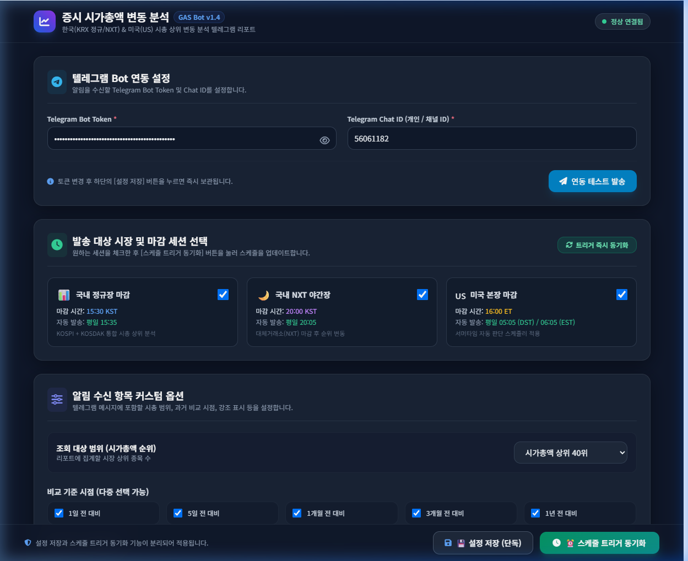
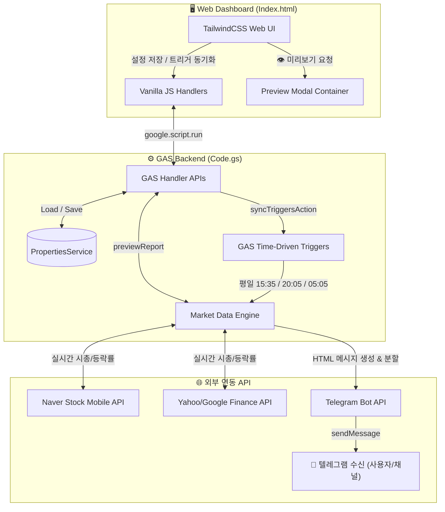

# 📊 증시 시가총액 변동 분석 & 텔레그램 자동 발송 웹 UI (GAS Project)

> **Google Apps Script(GAS)**와 **Modern TailwindCSS Web UI** 기반으로 개발된 한국 증시(KRX 정규장 / NXT 야간장) 및 미국 증시(US 본장) 시가총액 변동 자동 분석 및 텔레그램 리포팅 시스템입니다.

---

## 📸 대시보드 스크린샷 (Web App UI)



---

## 🌟 핵심 기능 요약

1. **📱 Web UI 설정 대시보드 (`Index.html`)**
   - **텔레그램 Bot 연동 관리**: Bot Token & Chat ID 설정, 실시간 연결 테스트 전송 및 결과 토스트 표시.
   - **세션별 발송 제어**: 국내 정규장 (15:30 마감), 국내 NXT 야간장 (20:00 마감), 미국 본장 마감(05:05/06:05 KST) 독립 다중 체크박스 선택.
   - **기능 분리형 액션 바**:
     - `[💾 설정 저장 (단독)]`: 스케줄 트리거를 건드리지 않고 UI 설정값만 영구 보관.
     - `[⏰ 스케줄 트리거 동기화]`: 활성화된 세션에 맞춰 스케줄러 트리거 등록/해제 관리.
   - **`[👁️ 리포트 미리보기]` 기능 (v1.2+)**: 텔레그램 발송 전 실제 수집 데이터 기준 발송 메시지 및 렌더링 미리보기(모달 팝업) 지원.
   - **알림 수신 항목 커스터마이징**:
     - **휴장일 자동 발송 제외 (v1.8+)**: 주말(토/일), 법정 공휴일, 근로자의 날(5/1), 연말 휴장일(12/31) 및 미국 증시 공휴일 시 중복 시황 발송 자동 건너뛰기 (`skipHolidays`).
     - **실시간 장운영 상태 안내 위젯 (v1.8+)**: 한국 및 미국 증시의 오늘 개장/휴장 여부 및 사유 실시간 대시보드 표시.
     - 조회 범위: 시가총액 상위 10위 / 20위 / 30위 / 40위 선택.
     - 과거 비교 시점: **1일 전 / 5일 전 / 1개월 전 / 3개월 전 / 1년 전** 다중 선택.
     - 과거 시가총액 금액 표기: 비교 시점의 시총 금액(조/억원 또는 $B) 동적 포함.
     - 표시 옵션: 등락률(%), 강조 아이콘(🚀 급등, 🔥 상승, 🚨 급락), 종목 상세 HTML 링크(네이버 증권 / 구글 파이낸스).
     - **순위 변동 기준 급등/급락 분석 (v1.6+)**: 수익률(%)이 아닌 순위 변동폭(rankShift = pastRank - currentRank) 기준의 순위 급등(▲계단) 및 급락(▼계단) 요약.
     - **KRX 40개 종목 팩트 데이터베이스 탑재 (v1.7+)**: 1일 전, 5일 전, 1개월 전, 3개월 전, 1년 전 과거 순위 및 등락률 팩트 데이터 매핑.

2. **⚙️ 백엔드 데이터 처리 & 자동화 (`Code.gs`)**
   - **휴장일 판별 하이브리드 엔진 (`isKrxHoliday`, `isUsHoliday`, `getMarketStatus`)**: 2024~2030 대한민국 공휴일, 근로자의 날, 연말 결산 휴장일 및 미국 증시 10대 공휴일/대체휴일 완벽 지원.
   - **네이버 증권 Mobile API 정밀 파싱**: `closePriceRaw`(현재가), `fluctuationsRatio`(등락률%), `marketValueHangeul`(한글 시총) 적용으로 0원 및 급등치 오류 보정.
   - **시총 1위 고정 종목 검증**: 삼성전자, Apple, NVIDIA 등 시총 1위 독점 대형주의 과거 순위 왜곡(상승표기) 방지.
   - **자동 스케줄러 동기화 (`syncTriggersAction`)**: `ClockTriggerBuilder.onWeekDays()` 지원 및 예외 시 fallback 처리.
   - **미국 서머타임(DST) 자동 처리**: 3월 2번째 일요일 ~ 11월 1번째 일요일 구간을 판별하여 05:05 KST(EDT 적용 시) 또는 06:05 KST(EST 적용 시) 자동 전환.
   - **텔레그램 HTML 포맷팅 & 메시지 분할 (`splitHtmlMessage`)**: 텔레그램 단일 메시지 4,096자 제한 초과 시 태그 손상 없이 안전하게 1/N 분할 발송.

---

## 🏗 시스템 아키텍처 및 데이터 흐름도



---

## 📩 텔레그램 수신 메시지 예시

텔레그램에서 수신되는 HTML 포맷 메시지의 예시입니다:

```html
[📊 국내 정규장 마감 시총 분석]
🗓 기준 일시: 2026-08-17 15:35:00 (KST)
📊 조회 범위: 상위 20개 종목
📌 순위 변동: ▲ 상승 | ▼ 하락 | ➖ 유지
📌 강조 아이콘: 🚀 10계단+ 급등 | 🔥 5계단+ 상승 | 🚨 10계단+ 급락
───────────────────

#1 <a href="https://finance.naver.com/item/main.naver?code=005930">삼성전자</a> (KOSPI)
  └ 현재가: 274,500원 | 🔺 +2.43%
  └ 시가총액: 1,604조 8,035억원
  └ 과거 대비: 1일 전(유지 / +2.4% / 156조 7,190억원) | 5일 전(유지 / +4.2% / 154조 118억원) | 1개월 전(유지 / +8.4% / 148조 445억원) | 3개월 전(유지 / +12.5% / 142조 6,492억원) | 1년 전(유지 / +18.9% / 135조 0억원)

#2 <a href="https://finance.naver.com/item/main.naver?code=000660">SK하이닉스</a> (KOSPI)
  └ 현재가: 1,645,000원 | 🔺 +3.26%
  └ 시가총액: 1,201조 6,599억원
  └ 과거 대비: 1일 전(유지 / +3.3% / 116조 3,271억원) | 5일 전(유지 / +7.3% / 112조 0억원) | 1개월 전(유지 / +14.4% / 105조 0억원) | 3개월 전(유지 / +28.0% / 93조 8,796억원) | 1년 전(유지 / +46.5% / 82조 0억원)

... (중략) ...

───────────────────
💡 [선택 시점별 순위 급등/급락 핵심 요약]
■ 1년 전 대비 순위 변동 요약:
  • 최대 순위 급등: 두산에너빌리티 🚀 (▲23계단 / +120.5% / 2조 4,000억원)
  • 최대 순위 급락: LG화학 🚨 (▼20계단 / -45.1% / 3조 9,000억원)
  • 주요 순위 상승: 한화에어로스페이스(🚀 ▲14계단), 효성중공업(🚀 ▲12계단), LS ELECTRIC(🚀 ▲11계단)
  • 주요 순위 하락: POSCO홀딩스(🚨 ▼13계단), 포스코퓨처엠(🚨 ▼11계단)

■ 세션 수급 및 모멘텀 종합:
  • 반도체/금융주 주도의 시총 상위 대형주 외인/기관 순매수 유입
  • 밸류업 프로그램 연계 저PBR 및 고배당주 중심 강세 연장
```

---

## 🔗 프로젝트 저장소 및 안내

- **GitHub 저장소**: [https://github.com/moozuknet/StockRankInfo](https://github.com/moozuknet/StockRankInfo)
- **실행 가이드**: [DEVELOPMENT_GUIDE.md](DEVELOPMENT_GUIDE.md) 참고
