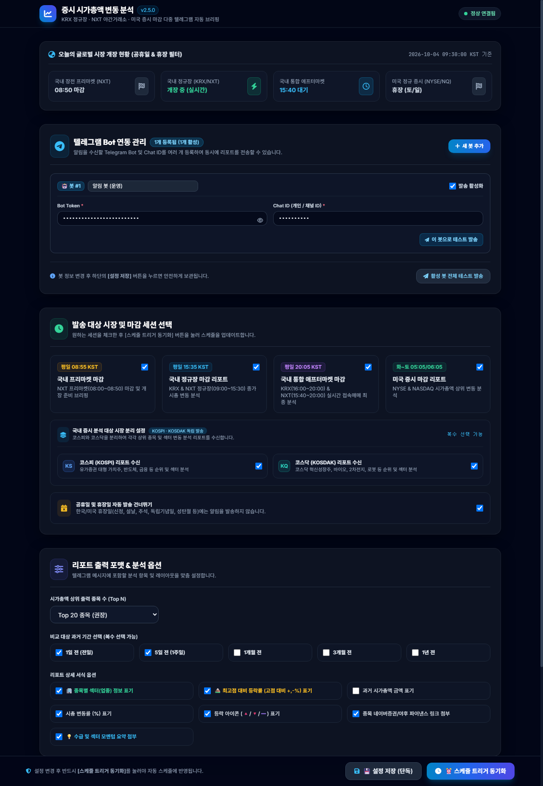
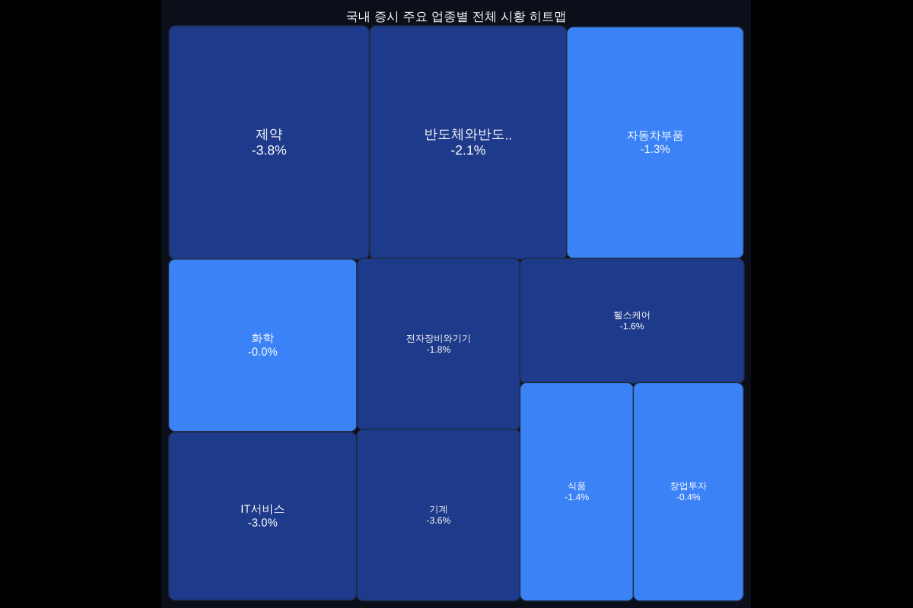
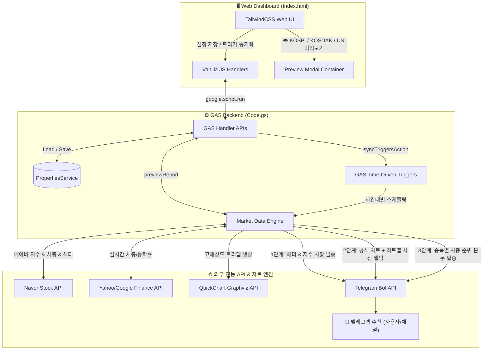

# 📊 증시 시가총액 변동 분석 & 텔레그램 자동 발송 웹 UI (GAS Project)

> **Google Apps Script(GAS)**와 **Modern TailwindCSS Web UI** 기반으로 개발된 한국 증시(NXT 프리마켓 / KRX·NXT 정규장 / 통합 애프터마켓) 및 미국 증시(US 본장) 시가총액 변동 자동 분석 및 텔레그램 리포팅 시스템입니다.

[](https://github.com/moozuknet/StockRankInfo)
[](https://developers.google.com/apps-script)
[](LICENSE)

---

## 📸 대시보드 & 시황 히트맵 스크린샷

### 1) 웹 설정 대시보드 (Web App UI)
> 💡 **v3.1.0 최신 대시보드 화면**: KOSPI/KOSDAK 독립 수신, 4대 시장 세션 스케줄러, WICS 섹터 및 **최고점 대비 등락률(고점 대비 +,-%) 표기 옵션**이 모두 반영된 최신 UI 화면입니다.



### 2) 전체 시황 업종별 고해상도 히트맵 (1200x800 HD)
> 💡 **모바일/PC 확대 시에도 선명한 텍스트 가독성**: 국내외 대표 10대 핵심 주도 섹터를 선별하고 가중 면적(규모) 및 26pt 대형 폰트를 적용하여 전체 시황을 한눈에 파악할 수 있는 고해상도 히트맵입니다.



---

## 🌟 핵심 기능 요약

1. **📈 최상단 지수 종합 시황 및 공식 차트 연동 (v3.0+)**
   - **시장별 핵심 지수 요약 노출**:
     - 🇰🇷 **국내 증시(KOSPI / KOSDAK)**: 코스피 지수 및 코스닥 지수의 현재 지수, 전일 대비 변동값(`+,-`), 등락률(`%`)을 리포트 최상단에 우선 표시.
     - 🇺🇸 **미국 증시(US)**: 글로벌 대표 핵심 지수인 **나스닥 종합(IXIC)** 및 **S&P 500(SPX)** 지수를 최상단에 브리핑 (불필요한 다우존스 제외).
   - **네이버 공식 지수 차트 실시간 연동**:
     - 코스피, 코스닥, 나스닥, S&P 500의 네이버 금융 공식 일봉/당일 지수 차트 이미지를 연동.
     - 텔레그램 서버의 이미지 캐싱으로 인한 구 데이터 노출을 원천 방지하기 위해 실시간 타임스탬프(`?t=Date.now()`) 자동 부착.

2. **🗺️ 전체 시황 업종/섹터별 고해상도 히트맵(트리맵) 엔진 (v3.1+)**
   - **전체 시장을 대변하는 10대 핵심 주도 업종 구성**:
     - 특정 개별 종목이 아닌 증시 전반의 수급 흐름을 조망할 수 있도록 국내(네이버 업종별 실시간 시황) 및 미국(대표 섹터 가중치) 10대 주도 섹터 집중 매핑.
   - **초고해상도(1200x800 HD) & 폰트 가독성 최적화**:
     - 기존의 작은 타일과 낮은 해상도(850x550)로 인한 모바일 탭/확대 시 글자 깨짐(열화) 현상을 완전히 해소.
     - 주요 업종명 폰트 크기를 **최대 26pt**로 대폭 확대하고, 긴 업종명을 직관적 핵심 키워드(`반도체`, `디스플레이`, `헬스케어/의료`, `소프트웨어/IT`)로 정제.
   - **시장별 맞춤형 컬러 코딩**:
     - 국내 증시: 상승 = 🔴 **빨강**, 하락 = 🔵 **파랑**
     - 미국 증시: 상승 = 🟢 **초록**, 하락 = 🔴 **빨강**

3. **📱 3단계 스마트 순차 전송 파이프라인 (v3.0+)**
   - 수신자의 열람 흐름에 최적화된 **3단계 순차 텔레그램 전송**:
     1. **1단계**: `[헤더 & 최상단 지수 종합 시황]` 텍스트 발송
     2. **2단계**: `[네이버 공식 지수 차트 + 고해상도 시총 히트맵]` 묶음 사진 앨범(`sendMediaGroup`) 발송 (시황 바로 아래 위치)
     3. **3단계**: `[종목별 시가총액 순위 분석 & 핵심 요약 리포트]` 본문 텍스트 순차 발송
   - 메시지 내 링크 미리보기 배너로 인한 스크롤 낭비를 방지하기 위해 `disable_web_page_preview: true` 기본 적용.

4. **📱 Web UI 설정 대시보드 (`Index.html`)**
   - **코스피(KOSPI) & 코스닥(KOSDAK) 분리 수신 설정**: 국내 증시 분석 시 코스피와 코스닥을 구분하여 독립적인 상위 종목 리포트 수신 가능 (`enableKospi`, `enableKosdak`).
   - **종목별 WICS 표준 섹터(업종) 정보 제공**: 79개 WICS 표준 업종 코드 체계 연동 및 대형주 팩트 섹터 캐시 탑재 (`#1 종목명 (시장 · 섹터)`).
   - **텔레그램 다중 Bot 연동 관리**: 여러 개의 텔레그램 봇(별칭, Bot Token, Chat ID) 등록 및 활성/비활성 제어, 개별/전체 즉각적인 연동 테스트 지원.
   - **2026.09.14 개편 시장별 4대 시간대별 발송 제어**:
     - 🌅 **국내 프리마켓 마감 (평일 08:55 KST)**: NXT 장전 프리마켓(08:00~08:50) 마감 및 개장 준비 브리핑.
     - 📊 **국내 정규장 마감 (평일 15:35 KST)**: KRX & NXT 정규 메인마켓(09:00~15:30) 종가 확정 후 마감 시총 분석.
     - 🌙 **국내 통합 애프터마켓 마감 (평일 20:05 KST)**: KRX(16:00~20:00) & NXT(15:40~20:00) 실시간 접속매매 최종 마감 분석.
     - 🇺🇸 **미국 본장 마감 (화~토 05:05/06:05 KST)**: NYSE & NASDAQ 본장 마감 및 서머타임 연동 분석.
   - **알림 수신 항목 커스터마이징**:
     - **휴장일 자동 발송 제외**: 주말(토/일), 법정 공휴일, 근로자의 날(5/1), 연말 휴장일(12/31) 및 미국 증시 공휴일 시 중복 시황 발송 자동 건너뛰기 (`skipHolidays`).
     - 조회 범위: 시가총액 상위 10위 / 20위 / 30위 / 50위 선택.
     - 과거 비교 시점: **1일 전 / 5일 전 / 1개월 전 / 3개월 전 / 1년 전** 다중 선택.
     - **최고점 대비 등락률 표기 (`showHighDiff`)**: 종목별 최고가(52주 최고가) 대비 현재가 변동률(+,-%) 및 최고가 금액 노출.
     - **순위 변동 기준 급등/급락 분석**: 순위 변동폭 기준 순위 급등(▲계단) 및 급락(▼계단) 요약.

---

## 🏗 시스템 아키텍처 및 데이터 흐름도


```mermaid
flowchart TD
    subgraph Frontend["🖥 Web Dashboard (Index.html)"]
        UI[TailwindCSS Web UI] -->|설정 저장 / 트리거 동기화| JS[Vanilla JS Handlers]
        UI -->|👁️ KOSPI / KOSDAK / US 미리보기| PreviewModal[Preview Modal Container]
    end

    subgraph Backend["⚙️ GAS Backend (Code.gs)"]
        JS <-->|google.script.run| API[GAS Handler APIs]
        API <-->|previewReport| Scraper[Market Data Engine]
        API <-->|Load / Save| Storage[(PropertiesService)]
        API -->|syncTriggersAction| Scheduler[GAS Time-Driven Triggers]
    end

    subgraph External["🌐 외부 연동 API & 차트 엔진"]
        Scheduler -->|시간대별 스케줄링| Scraper
        Scraper <-->|네이버 지수 & 시총 & 섹터| Naver[Naver Stock API]
        Scraper <-->|실시간 시총/등락률| Yahoo[Yahoo/Google Finance API]
        Scraper -->|고해상도 트리맵 생성| QuickChart[QuickChart Graphviz API]
        Scraper -->|1단계: 헤더 & 지수 시황 발송| Telegram[Telegram Bot API]
        Scraper -->|2단계: 공식 차트 + 히트맵 사진 앨범| Telegram
        Scraper -->|3단계: 종목별 시총 순위 본문 발송| Telegram
        Telegram --> UserDevice["📱 텔레그램 수신 (사용자/채널)"]
    end
```

---

## ⏰ 최신 시장 운영 시간 및 발송 스케줄 비교

| 세션 구분 | 마켓 운영 시간 | 발송 시각 (KST) | 설명 |
| :--- | :--- | :--- | :--- |
| **🌅 국내 장전 프리마켓** | NXT: 08:00 ~ 08:50 | **평일 08:55** | NXT 장전 접속매매 마감 직후 코스피/코스닥 개장 준비 브리핑 |
| **📊 국내 정규 메인마켓** | KRX: 09:00~15:30 / NXT: 09:00:30~15:20 | **평일 15:35** | 정규 거래 세션 종가 기준 코스피/코스닥 시가총액 변동 분석 |
| **🌙 국내 통합 애프터마켓** | KRX: 16:00~20:00 / NXT: 15:40~20:00 | **평일 20:05** | 양대 거래소 애프터마켓 실시간 접속매매 마감 분석 |
| **🇺🇸 미국 정규 증시** | 미 현지: 09:30 ~ 16:00 | **화~토 05:05 / 06:05** | NYSE & NASDAQ 마감 분석 (DST 자동 연동, 나스닥/S&P500 중심) |

---

## 📩 텔레그램 수신 메시지 흐름 예시

### [1단계 메시지: 헤더 & 지수 종합 시황]
```html
<b>[📊 국내 정규장 - 코스피(KOSPI) 마감 시총 분석]</b>
🗓 <b>기준 일시:</b> 2026-10-08 15:35:00 (KST)
📊 <b>조회 범위:</b> 상위 20개 종목
📌 <b>순위 변동:</b> ▲ 상승 | ▼ 하락 | ➖ 유지
📌 <b>강조 아이콘:</b> 🚀 10계단+ 급등 | 🔥 5계단+ 상승 | 🚨 10계단+ 급락
───────────────────
📈 <b>[종합 시황 지수]</b>
• <b>코스피:</b> 2,580.40 (🔺 +12.30, +0.48%)
• <b>코스닥:</b> 745.20 (🔺 +3.10, +0.42%)
───────────────────
```

### [2단계 미디어: 공식 차트 & 고해상도 히트맵 사진 앨범 (`sendMediaGroup`)]
- 🖼️ **1번 사진**: 네이버 증권 공식 코스피/코스닥 지수 차트
- 🖼️ **2번 사진**: 1200x800 HD 고해상도 업종별 전체 시황 히트맵

### [3단계 메시지: 종목별 시총 순위 분석 & 핵심 요약]
```html
#1 <a href="https://finance.naver.com/item/main.naver?code=005930">삼성전자</a> <code>(KOSPI · 반도체)</code>
  └ 현재가: 274,500원 | 🔺 +2.43%
  └ 시가총액: 1,604조 8,035억원
  └ 고점 대비: -27.76% (최고 380,000원)
  └ 과거 대비: 1일 전(유지 / +2.4%) | 5일 전(유지 / +4.2%) | 1개월 전(유지 / +8.4%) | 3개월 전(유지 / +12.5%) | 1년 전(유지 / +18.9%)

#2 <a href="https://finance.naver.com/item/main.naver?code=000660">SK하이닉스</a> <code>(KOSPI · 반도체)</code>
  └ 현재가: 1,645,000원 | 🔺 +3.26%
  └ 시가총액: 1,201조 6,599억원
  └ 고점 대비: -45.20% (최고 3,002,000원)
  └ 과거 대비: 1일 전(유지 / +3.3%) | 5일 전(유지 / +7.3%) | 1개월 전(유지 / +14.4%) | 3개월 전(유지 / +28.0%) | 1년 전(유지 / +46.5%)

... (중략) ...

───────────────────
💡 <b>[선택 시점별 순위 급등/급락 핵심 요약]</b>
■ 1년 전 대비 순위 변동 요약:
  • 최대 순위 급등: 두산에너빌리티 [기계] 🚀 (▲23계단 / +120.5% / 2조 4,000억원)
  • 최대 순위 급락: LG화학 [화학] 🚨 (▼20계단 / -45.1% / 3조 9,000억원)
  • 주요 순위 상승: 한화에어로스페이스(·우주항공)(🚀 ▲14계단)
  • 주요 순위 하락: POSCO홀딩스(·철강)(🚨 ▼13계단)
```

---

## 🔗 프로젝트 저장소 및 안내

- **GitHub 저장소**: [https://github.com/moozuknet/StockRankInfo](https://github.com/moozuknet/StockRankInfo)
- **개발 및 기술 가이드**: [DEVELOPMENT_GUIDE.md](DEVELOPMENT_GUIDE.md) 참고
